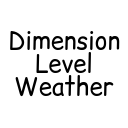
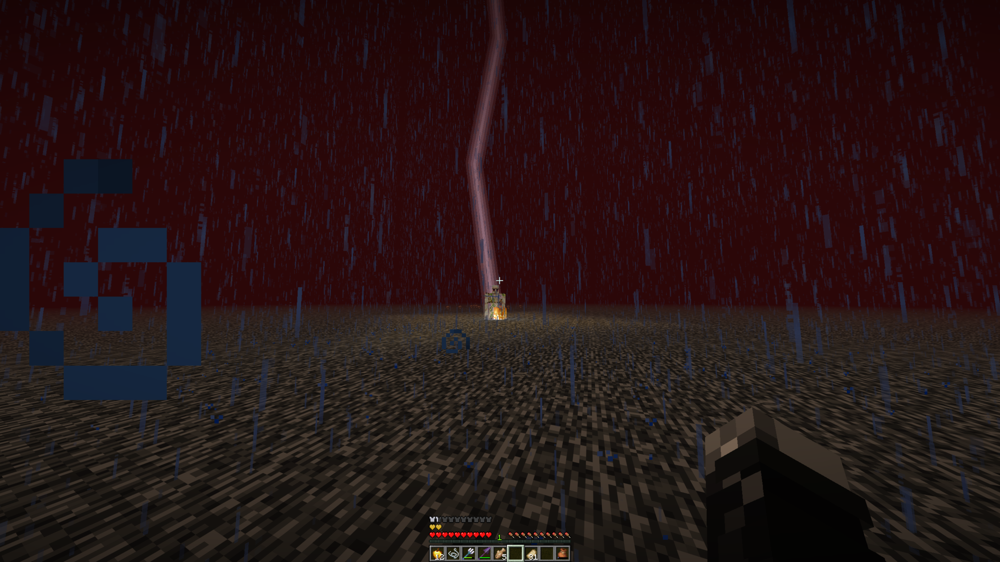
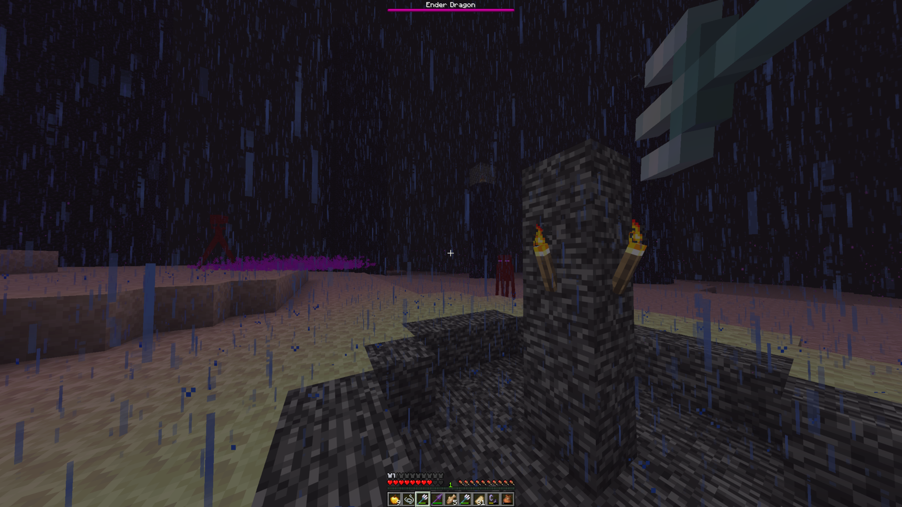

#  Dimension Level Weather

A Fabric mod that adds per-dimension weather and time control. Set rain, thunder, or clear skies independently in the Nether, End, and any custom dimension — without touching other dimensions.


## Requirements

- Minecraft 26.2
- Fabric Loader ≥ 0.19.3
- Fabric API
- Java 25

## Features

- Weather state (clear/rain/thunder) per dimension
- Rain particles render correctly in any dimension
- Fire is extinguished by rain, including in the Nether and End
- Crops are watered and cauldrons fill during rain, just like in the overworld
- Snow falls instead of rain in cold biomes if the biome temperature supports it
- Thunder enables Channeling enchantment and damages Endermen
- Riptide works during rain or thunder in any dimension
- Per-dimension control over whether weather and time advance naturally
- Per-dimension infiniburn, fast lava, and water evaporation rules
- All settings persist across server restarts
- Works on dedicated servers — no client mod required

## Commands

All commands require gamemaster permission level.

### dimweather

| Command | Description |
|---------|-------------|
| `dimweather set <dimension> clear\|rain\|thunder` | Set the weather state for a specific dimension. |
| `dimweather clear\|rain\|thunder` | Set the same weather state across all loaded dimensions at once. |
| `dimweather query [dimension]` | Show the current weather state and all rules for one or all dimensions. Values matching vanilla defaults are labelled accordingly. |
| `dimweather advance <dimension> true\|false` | Control whether weather cycles naturally in a dimension. When false, the current weather state is locked indefinitely. |
| `dimweather infiniburn <dimension> true\|false` | Control whether fire burns indefinitely on infiniburn blocks (e.g. netherrack) in the dimension. |
| `dimweather fast_lava <dimension> true\|false` | Control whether lava flows at nether speed in the dimension. |
| `dimweather water_evaporates <dimension> true\|false` | Control whether water evaporates in the dimension. When false, water can be placed and used normally even in the Nether. |
| `dimweather reset <dimension> [field]` | Reset a specific rule or all weather rules for a dimension back to vanilla defaults. Omit the field to reset all rules at once. |
| `dimweather reset all` | Reset all weather rules for every loaded dimension back to vanilla defaults. |

The vanilla `/weather` command is overridden by this mod. `/weather rain` and `/weather thunder` affect the overworld only, matching vanilla behaviour. `/weather clear` clears weather across all dimensions.

### dimtime

| Command | Description |
|---------|-------------|
| `dimtime set <dimension> day\|noon\|night\|midnight\|<ticks>` | Set the time of day for a specific dimension. Named values are shortcuts: day=1000, noon=6000, night=13000, midnight=18000. |
| `dimtime advance <dimension> true\|false` | Control whether time progresses in a dimension. When false, the sun and moon are frozen at their current position. |
| `dimtime query [dimension]` | Show the current time and advance_time rule for one or all dimensions. |
| `dimtime reset <dimension>` | Reset all time rules for a dimension back to vanilla defaults. |
| `dimtime reset all` | Reset all time rules for every loaded dimension back to vanilla defaults. |

## Configuration

A config file is created at `config/dimension-level-weather.json` on first launch. It controls weather cycle behaviour per dimension:

```json
{
  "dimensions": {
    "minecraft:overworld": {
      "thunder_chance": 0.01,
      "min_clear_duration": 12000,
      "max_clear_duration": 180000,
      "min_rain_duration": 12000,
      "max_rain_duration": 24000
    }
  }
}
```

Add entries for any dimension using its full ID (e.g. `minecraft:the_nether`).

## Vanilla defaults

| Rule             | Overworld | Nether | End   |
|------------------|-----------|--------|-------|
| advance_weather  | true      | false  | false |
| advance_time     | true      | false  | false |
| infiniburn       | true      | true   | true  |
| fast_lava        | false     | true   | false |
| water_evaporates | false     | true   | false |

## Screenshots


*Thunder in the Nether — Channeling enchantment works*


*Rain in the End — Endermen take damage, Riptide works*

## License

MIT
